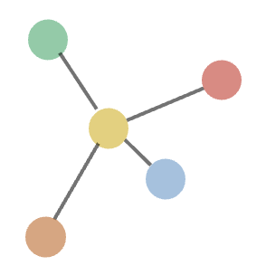

  

  <h1 align="center">
  COMPLEX
</h1>

  The complex of Connectivist-Oriented Multiple Personal Learning Environments

  

  

  
 
  

English | <a href="docs/README_zh.md">简体中文</a>

## Document
Want to know more about COMPLEX? Please read the [help document](complex-docs.readthedocs.io) 👈
 
